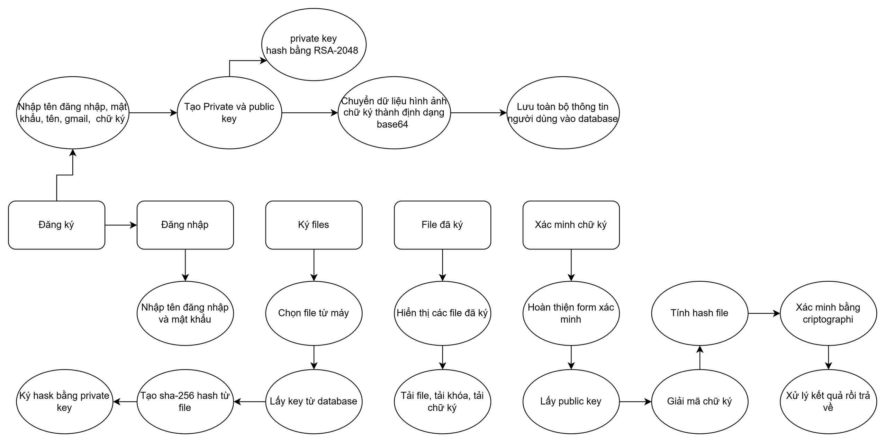
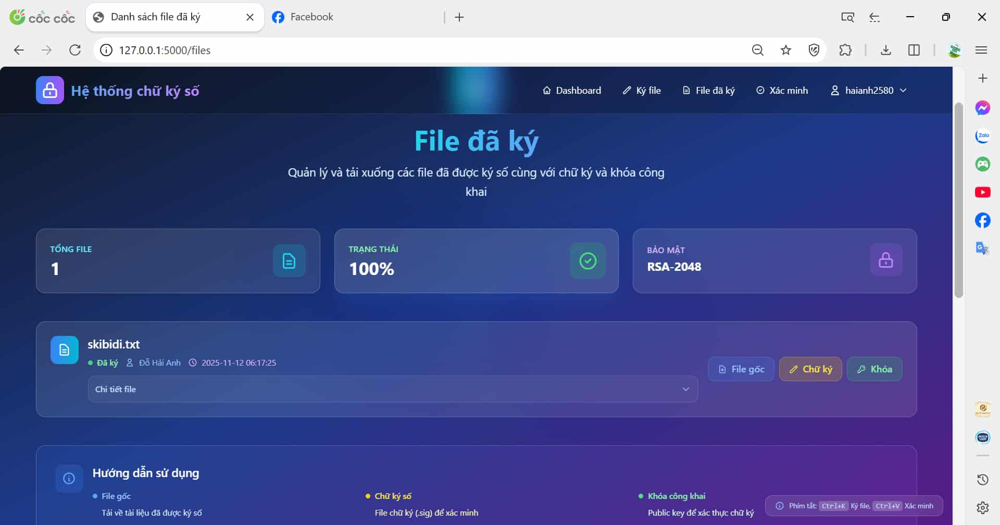
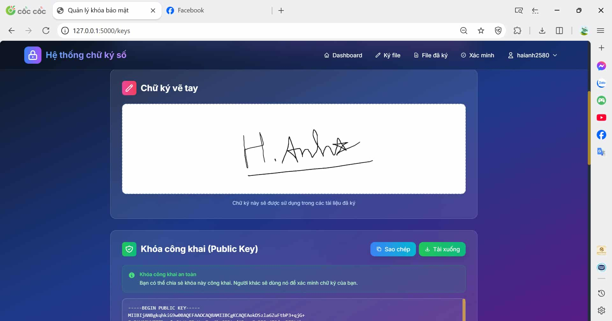

# Hệ thống chữ ký số RSA
<div style="display: flex; justify-content: center; align-items: center; margin-bottom: 20px;">
  
  
</div>

<!-- Navigation Buttons -->
<div style="text-align: center; margin-bottom: 20px;">
<button style="display: inline-block; padding: 10px 20px; background-color: #28a745; color: #fff; border-radius: 5px; text-decoration: none; margin: 0 5px;><a href="https://www.facebook.com/DNUAIoTLab" ">Made by AIoTLab</a></button>
  <button style="display: inline-block; padding: 10px 20px; background-color: #28a745; color: #fff; border-radius: 5px; text-decoration: none; margin: 0 5px;><a href="https://www.facebook.com/DNUAIoTLab" ">Made by AIoTLab</a></button>
  <button style="display: inline-block; padding: 10px 20px; background-color: #dc3545; color: #fff; border-radius: 5px; text-decoration: none; margin: 0 5px;><a href="https://fitdnu.net/" ">Fit DNU</a></button>
  <button style="display: inline-block; padding: 10px 20px; background-color: #ffc107; color: #333; border-radius: 5px; text-decoration: none; margin: 0 5px;><a href="https://dainam.edu.vn/vi" ">DaiNam University</a></button>
</div>

<hr>

## 📋 Tổng quan

  Hệ thống chữ ký số sử dụng thuật toán RSA-PSS với hash SHA-256, cho phép người dùng tạo chữ ký số cho các file và xác minh tính toàn vẹn của chúng. Được xây dựng bằng Flask và SQLite, cung cấp giao diện web thân thiện để quản lý chữ ký số.



## ✨ Tính năng chính

- **Tạo cặp khóa RSA 2048-bit**: Tự động sinh khóa công khai và khóa riêng
- **Đăng ký người ký**: Quản lý thông tin người ký và lưu trữ chữ ký hình ảnh
- **Ký file số**: Upload và ký file với thuật toán RSA-PSS
- **Xác minh chữ ký**: Kiểm tra tính hợp lệ của chữ ký số
- **Quản lý file**: Xem danh sách file đã ký và tải xuống
- **API endpoints**: Truy xuất thông tin qua REST API

## 🔐 Công nghệ bảo mật

| Thành phần | Công nghệ | Mô tả |
|------------|-----------|-------|
| **Mã hóa** | RSA 2048-bit | Thuật toán mã hóa bất đối xứng |
| **Hash** | SHA-256 | Hàm băm mật mã học |
| **Chữ ký** | RSA-PSS | Probabilistic Signature Scheme |
| **Encoding** | Base64 | Mã hóa dữ liệu nhị phân |

## 🛠️ Cài đặt

### Yêu cầu hệ thống
```
Python 3.7+
Flask
SQLite3
Cryptography library
```

### Cài đặt dependencies
```bash
pip install flask
pip install cryptography
pip install werkzeug
```

## 🚀 Chạy ứng dụng

```bash
python app.py
```

Truy cập ứng dụng tại: `http://localhost:5000`

## 📁 Cấu trúc thư mục

```
digital-signature-system/
├── app.py                 # File chính của ứng dụng
├── static                 # File ảnh ứng dụng
├── digital_signature.db   # Database SQLite (tự động tạo)
├── uploads/              # Thư mục lưu file upload
├── templates/            # Templates HTML
│   ├── base.html
│   ├── 400.html
│   ├── 500.html
│   ├── index.html
│   ├── login.html
│   ├── register.html
│   ├── dashboard.html
│   ├── keys.html
│   ├── sign.html
│   ├── files.html
│   └── verify.html
└── README.md
```

## 💾 Cấu trúc Database

### Bảng `users` – Người dùng & khóa RSA
| Cột             | Kiểu dữ liệu                      | Mô tả                             |
| --------------- | --------------------------------- | --------------------------------- |
| id              | INTEGER PRIMARY KEY AUTOINCREMENT | ID người dùng                     |
| username        | TEXT UNIQUE                       | Tên đăng nhập                     |
| password_hash   | TEXT                              | Mật khẩu đã băm                   |
| full_name       | TEXT                              | Họ tên đầy đủ                     |
| email           | TEXT                              | Email                             |
| private_key     | TEXT                              | Private key RSA (PEM)             |
| public_key      | TEXT                              | Public key RSA (PEM)              |
| signature_image | TEXT                              | Hình chữ ký người dùng (tùy chọn) |
| created_at      | TIMESTAMP                         | Thời điểm đăng ký                 |
| updated_at      | TIMESTAMP                         | Thời điểm cập nhật                |


### Bảng `signed_files`– Lưu trữ file đã ký
| Cột                | Kiểu dữ liệu                      | Mô tả                          |
| ------------------ | --------------------------------- | ------------------------------ |
| id                 | INTEGER PRIMARY KEY AUTOINCREMENT | ID bản ghi                     |
| user_id            | INTEGER                           | Khóa ngoại liên kết bảng users |
| original_filename  | TEXT                              | Tên file người dùng upload     |
| signed_filename    | TEXT                              | Tên file được lưu trên server  |
| signature_filename | TEXT                              | File chữ ký `.sig`             |
| file_hash          | TEXT                              | Hash SHA-256 của file (base64) |
| signature_data     | TEXT                              | Chữ ký số (base64)             |
| created_at         | TIMESTAMP                         | Thời điểm ký file              |


## 🔄 Luồng hoạt động

### 1. Đăng ký tài khoản
```
Nhập username + mật khẩu + họ tên  
→ Hệ thống sinh cặp RSA (private + public key)  
→ Lưu vào bảng users  
→ Đăng nhập để tiếp tục
```

### 2. Đăng nhập
```
Nhập username/password → Kiểm tra password_hash  
→ Lưu session (user_id, username, full_name)  
→ Chuyển đến Dashboard
```

### 3. Ký file
```
User upload file  
→ Hệ thống tính hash SHA-256  
→ Load private key của user  
→ Ký bằng RSA-PSS  
→ Lưu file + chữ ký vào uploads/  
→ Lưu record vào signed_files
```
### 4. Xác minh chữ ký
```
Upload file  
→ Nhập public key hoặc chọn user  
→ Nhập chữ ký base64  
→ Xác minh RSA-PSS  
→ Trả về “Hợp lệ” hoặc “Không hợp lệ”
```
### 5. Quản lý file đã ký
```
Xem danh sách file  
→ Tải xuống file gốc  
→ Tải xuống chữ ký  
→ Tải xuống public key
```
## 📡 API Endpoints

| Endpoint                          | Method   | Yêu cầu đăng nhập | Mô tả                      |
| --------------------------------- | -------- | ----------------- | -------------------------- |
| `/`                               | GET      | ❌                 | Trang chủ                  |
| `/register`                       | GET/POST | ❌                 | Đăng ký tài khoản mới      |
| `/login`                          | GET/POST | ❌                 | Đăng nhập                  |
| `/logout`                         | GET      | ✔️                | Đăng xuất                  |
| `/dashboard`                      | GET      | ✔️                | Trang bảng điều khiển      |
| `/profile`                        | GET/POST | ✔️                | Cập nhật thông tin cá nhân |
| `/keys`                           | GET      | ✔️                | Xem private/public key     |
| `/sign`                           | GET/POST | ✔️                | Ký file                    |
| `/files`                          | GET      | ✔️                | Danh sách file đã ký       |
| `/verify`                         | GET/POST | ❌                 | Xác minh chữ ký            |
| `/download/original/<filename>`   | GET      | ✔️                | Tải file gốc               |
| `/download/signature/<filename>`  | GET      | ✔️                | Tải file chữ ký            |
| `/download/public_key/<username>` | GET      | ✔️                | Tải public key             |
| `/api/signer/<username>`          | GET      | ❌                 | Lấy public key dạng JSON   |


## 🛡️ Bảo mật

### Điểm mạnh:
-  RSA-PSS – padding an toàn nhất hiện nay
-  SHA-256 – hashing mạnh
-  2048-bit key size
-  Mã hóa private key dạng PEM
-  Kiểm soát session Flask
-  Giới hạn kích thước upload 16MB
-  secure_filename chống upload độc hại


## 📝 Sử dụng


### 1. Đăng nhập


1. Truy cập trang `Đăng nhập`
2. Nhập tài khoản / mật khẩu
3. Nhấn **"Login"** để vào hệ thống
---

## 2. 🌐 Dashboard


Tại trang Dashboard, người dùng có thể truy cập nhanh đến các chức năng chính của hệ thống ký số.

---

## 3. ✍️ Ký file số


### 2. Ký files

1. Truy cập mục **"Ký files số"**
2. Chọn người ký hoặc khóa ký đã có
3. Tải lên file cần ký
4. Nhấn **"Ký file"**
5. Hệ thống tự động tạo chữ ký số cho file

---

## 4. 📁 Files đã ký



### 3. Quản lý files đã ký

1. Truy cập **"Files đã ký"**
2. Có thể:

   * Tải file đã ký
   * Tải chữ ký số
   * Tải khóa
   * Xem thông tin Public Key

---

## 5. 🔍 Xác minh chữ ký số


### 4. Xác minh chữ ký

1. Truy cập **"Xác minh chữ ký số"**
2. Tải lên file cần kiểm tra
3. Tải lên hoặc nhập thủ công **Public Key**
4. Nhập chữ ký số (Base64) hoặc
5. Tải file chữ ký số từ máy
6. Nhấn **"Xác minh"**

---

## 6. 📤 Tải file chữ ký số


Cho phép người dùng tải file chữ ký số lên thay vì nhập thủ công.

---

## 7. ℹ️ Thông tin chữ ký



Trang hiển thị thông tin chi tiết của chữ ký số:

* Thuật toán
* Hash
* Dữ liệu đã ký
* Thời gian ký
* Người ký

---

## 8. 🔐 Thông tin khóa riêng tư


Hiển thị thông tin private key:

* Tên người ký
* Mã nhận diện
* Dung lượng & thuật toán sinh khóa

---

## 9. 🔓 Hiển thị khóa riêng tư


Trang cho phép xem chi tiết private key (được bảo vệ và chỉ xem khi có quyền).

## 🐛 Xử lý lỗi

| Lỗi | Nguyên nhân | Giải pháp |
|-----|-------------|-----------|
| "Tên này đã tồn tại" | Trùng tên người ký | Sử dụng tên khác |
| "Vui lòng chọn file" | Không upload file | Upload file hợp lệ |
| "Chữ ký không hợp lệ" | File bị thay đổi hoặc chữ ký sai | Kiểm tra lại file và chữ ký |
| "Lỗi khi ký file" | Lỗi xử lý file | Kiểm tra định dạng file |

## Test xác minh chữ ký 
1. Chọn **xác minh chữ ký**
2. Chọn tệp : [upload/text.txt]
3. Chọn người ký: [Kanchou]
4. Chọn tệp file chữ ký đã tải sẵn: [uploads/text.txt.sig]
5. Bấm xác minh chữ ký 


## 👥 Tác giả

- **Kacnhou2420** - *Initial work* - [GitHub Profile](https://github.com/kanchou2420)


**Liên hệ**: [0966826423]  
**Facebook**: [https://www.facebook.com/loi.hien.thi.579358?locale=vi_VN]  
**Gmail**: [hanh64723@gmail.com]
